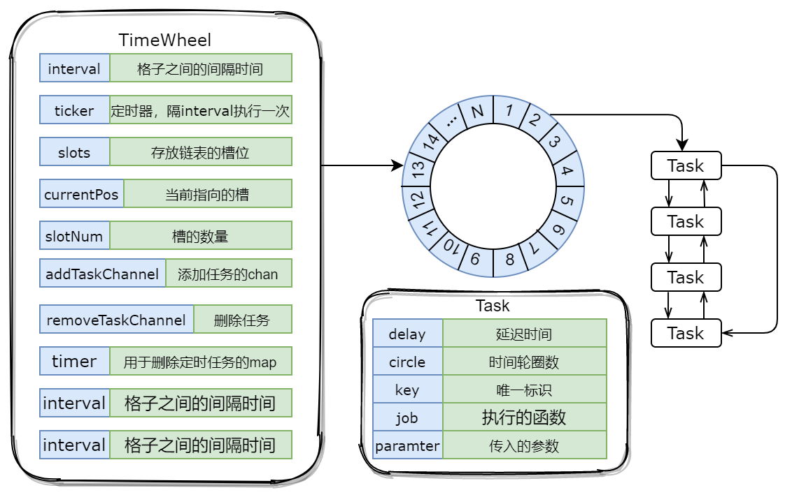
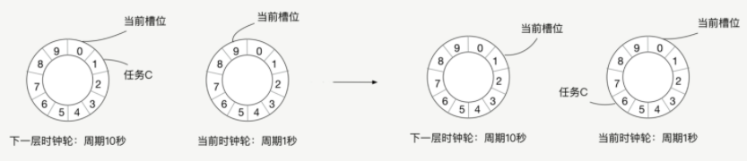

## TimeWheel

 一个基于Golang的时间轮

时间轮主要场景：主要用在高效的执行项目中的定时任务，实现延时队列等应用场景。



时间轮代码：

* timewheel.go 时间轮的核心代码

*  main.go  测试函数 添加任务，删除任务，停止时间轮

### 使用场景

时间轮的应用主要体现在如下两个方面：

- **失败重试，** 例如，Provider 向注册中心进行注册失败时的重试操作，或是 Consumer 向注册中心订阅时的失败重试等。
- **周期性定时任务，** 例如，定期发送心跳请求，请求超时的处理，或是网络连接断开后的重连机制。
- **延时消息的功能**，比如让一个任务几分钟之后发送一条消息出去。在比如可以实现订单过期功能，用户下单10分钟没付款，就取消订单，可以通过时钟轮实现。

### 基本原理

本来可以使用sleep，每次启动一个线程，sleep到规定时间就触发超时逻辑。但是在高并发场景下，太耗费资源，所以不可行。

还有另一种实现方式。我们可以用一个线程来处理所有的定时任务，我们启动一个线程，这个线程每隔 100 毫秒会扫描一遍所有的处理 Future 超时的任务，当发现一个 Future 超时了，我们就执行这个任务，对这个 Future 执行超时逻辑。这种方式每隔100ms就需要对所有任务进行扫描，当任务足够多，每秒就需要对所有线程扫描10次，很浪费CPU;

##### 时间轮

在时钟轮机制中，有**时间槽和时钟轮**的概念，时间槽就相当于**时钟的刻度**，而时钟轮就相当于秒针与分针等跳动的一个周期，我们会将每个任务放到对应的时间槽位上。



分为当前时间轮和下一个时间轮,假设当前时间轮每一个槽位代表100ms，一共九个槽位共1s，则下一个时间轮每一个槽位为1s , 当前时间轮转完后，下一个时间轮就会转动一个槽位，将下一个时间轮槽位任务分配到当前时间轮中。

两个注意点：

1. 时间槽位的单位时间越短，时间轮触发任务的时间就越精确。例如时间槽位的单位时间是 10 毫秒，那么执行定时任务的时间误差就在 10 毫秒内，如果是 100 毫秒，那么误差就在 100 毫秒内。
2. 时间轮的槽位越多，那么一个任务被重复扫描的概率就越小，因为只有在多层时钟轮中的任务才会被重复扫描。比如一个时间轮的槽位有 1000 个，一个槽位的单位时间是 10 毫秒，那么下一层时间轮的一个槽位的单位时间就是 10 秒，超过 10 秒的定时任务会被放到下一层时间轮中，也就是只有超过 10 秒的定时任务会被扫描遍历两次，但如果槽位是 10 个，那么超过 100 毫秒的任务，就会被扫描遍历两次。

在代码实现上，当前时间轮和下一个时间轮主要体现在Task字段的circle上,如下代码

```go
// Task 延时任务
type Task struct {
	delay  time.Duration // 延迟时间
	circle int           // 时间轮需要转动几圈
	key    interface{}   // 定时器唯一标识, 用于删除定时器
	job   Job    // 回调函数
	parameter interface{}
}
```

在加入任务的时候，我们会根据传入的延迟时间，计算圈数circle，代码如下

```go
// 获取定时器在槽中的位置, 时间轮需要转动的圈数
func (tw *TimeWheel) getPositionAndCircle(d time.Duration) (pos int, circle int) {
	delaySeconds := int(d.Seconds())
	intervalSeconds := int(tw.interval.Seconds())
	circle = int(delaySeconds / intervalSeconds / tw.slotNum)//很重要，计算圈数
	pos = int(tw.currentPos+delaySeconds/intervalSeconds) % tw.slotNum//计算所在圈的位置pos
	return
}
```

